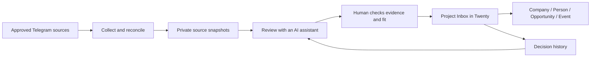

# Radar

**Turn Telegram conversations into opportunities you can actually review.**

[](https://github.com/drozdovich/Radar/actions/workflows/check.yml)

Radar is a personal tool for finding projects, useful professional contacts and events in selected Telegram channels. It keeps the original evidence, explains why something might matter, and asks for a human decision before turning a finding into a CRM record.

**Version 0.34.0 · Python + TypeScript · Working prototype · AI-assisted development**

[Русская версия](docs/README.ru.md) · [Try the demo](#try-it-without-accounts-or-keys) · [Architecture](ARCHITECTURE.md) · [Roadmap](ROADMAP.md)

## The problem

Good opportunities arrive inside noisy conversations: a short request, a reply, or one position in a long digest. A bookmark loses context; a keyword alert cannot distinguish a buyer from a vendor or a confirmed project from a hypothesis.

Radar makes a reviewable card: **original text → exact quote → proposed fit → unknowns → your decision**. A company mentioned in a message is not automatically a customer. Nothing sends replies or applications on your behalf.

## Try it without accounts or keys

With Python 3.12–3.14 and [uv](https://docs.astral.sh/uv/getting-started/installation/):

```sh
git clone https://github.com/drozdovich/Radar.git
cd Radar
uv run --locked radar demo
```

```text
Radar offline demo — synthetic messages and scripted decisions
2 messages reviewed → 2 cards
Retry: 2 existing decisions preserved, 0 duplicates
```

Open `.radar/demo/demo.md` for the walkthrough or `.radar/demo/demo.json` for the structured result. [Read an already generated example](examples/demo.md).

The demo uses the real review, evidence validation and delivery code with an in-memory Inbox. All messages and decisions are invented; review decisions are scripted. It needs no Telegram session, CRM, model API or Node installation. It demonstrates the software contracts, not AI accuracy or the live CRM interface.

## How it works



- **Collection:** resumable windows, two passes over message contents, explicit gaps and comment checks.
- **Review:** every primary message gets a decision; candidates carry exact evidence and unknowns.
- **Digest positions:** several independent proposals in one post get separate cards anchored to exact text spans.
- **Delivery:** stable identities and read-back verification keep retries from duplicating cards or replacing earlier decisions.
- **Twenty Review:** a TypeScript extension for Approve, Reject and Need info, with notes and linked records.
- **Feedback:** current CRM status and decision history remain distinct; an isolated rejection does not silently become a global rule.

## Where to look in the code

| Question | Start here |
|---|---|
| How does collection resume without losing hours? | [pipeline.py](src/telegram_project_radar/pipeline.py) |
| How are evidence and review decisions recorded? | [agent_review.py](src/telegram_project_radar/agent_review.py) |
| How are exact digest positions validated? | [semantic_pipeline.py](src/telegram_project_radar/semantic_pipeline.py) |
| What happens on a delivery retry? | [semantic_delivery.py](src/telegram_project_radar/semantic_delivery.py) |
| What does the user review in Twenty? | [Review component](apps/twenty-review/src/front-components/review.tsx) |
| Can I reproduce the example? | [demo.py](src/telegram_project_radar/demo.py), [demo test](tests/test_public_demo.py) |

The current assistant workflow uses Codex. The repository also retains an optional model-API route and older deterministic selectors. Their presence does not mean they run together or learn automatically.

## Run the checks

Python 3.12–3.14, uv and Node 24.5+ from the Node 24 release line:

```sh
uv sync --locked
npm ci --ignore-scripts
npm --prefix apps/twenty-review ci --ignore-scripts
npm run check
```

GitHub Actions runs the same checks and builds the Python package. Unit tests use fake Telegram and CRM boundaries; they do not contact the operator's systems. See [development](docs/DEVELOPMENT.md) and [data map](docs/DATA_MAP.md).

## Current scope and next work

This is a working personal prototype, not a hosted service or a one-command production installer. The public repository includes code, tests and synthetic examples. Real messages, review datasets, credentials and installation history are kept out of it.

The next engineering milestone is a reproducible installation and acceptance test of the complete review flow: source → evidence → decision → correctly linked CRM objects. Open items include Company/Opportunity identity checks, live UI acceptance and setup/restore documentation. Collection completeness does not prove semantic recall; unsupported media remains an explicit limitation.

Development uses Codex for implementation and review. Product decisions and approvals stay with the owner. The hackathon goal is to improve this narrow end-to-end workflow and evaluate it on fresh examples; see the [application draft](docs/HACKATHON.md).
