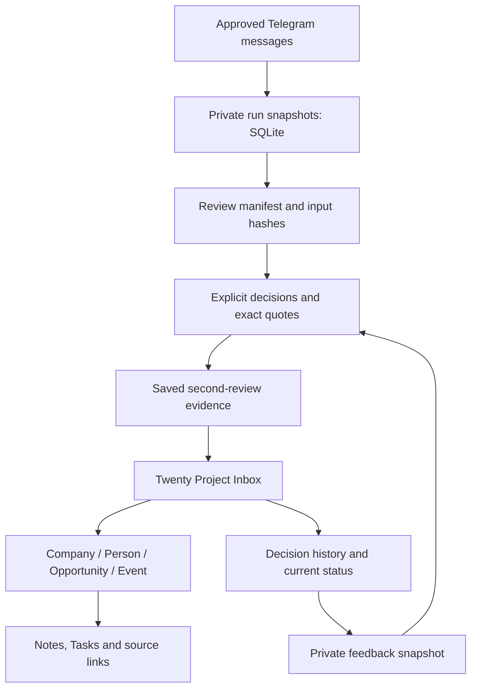

# Data map

| Data | Location | What it proves |
|---|---|---|
| Original messages and reply context | Private `.radar/` run SQLite files | What the collector actually observed |
| Run state/checkpoints | Private run JSON | Which source/window/pass completed |
| Batches, answers and audit | Private `agent-review/` artifacts | Which unchanged input was reviewed and why |
| Inbox cards | Configured Twenty workspace | Material awaiting a native decision |
| Native objects and Notes/Tasks | Twenty | Approved result and retained context |
| Current feedback snapshot | Private `.radar/feedback-daily/` | Current statuses plus historical decisions |
| Source registry/profile | Private local configuration | What the owner authorised and prefers |
| Code, tests and invented examples | Public Git repository | Reproducible implementation, not operational backups |

A source mention is not a confirmed customer. An Inbox NEW card is not an approved native record. An old Reject is not necessarily the current status. These distinctions prevent evidence from silently becoming a claim.

Git does not back up the operational database, Telegram session, queue or private decisions. The demo produces local synthetic files only and never reads the live Inbox.
